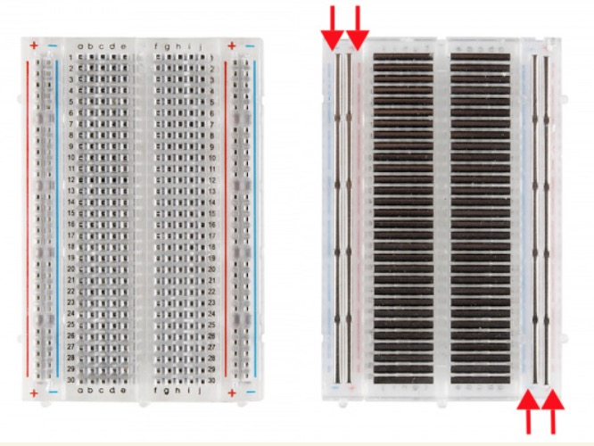

> We'll learn some basics of how to interact with Arduino and sensors. Since I had zero experience in Electrical Engineering (EE), I'll need to start from scratch, literally.

List of components:
* [Arduino UNO R3](https://www.amazon.com/gp/product/B01EWOE0UU/ref=ox_sc_act_title_8?smid=A2WWHQ25ENKVJ1&psc=1)
* [Distance Sensor (comes with a bunch of jump wires)](https://www.amazon.com/gp/product/B01COSN7O6/ref=ox_sc_act_title_6?smid=A2WWHQ25ENKVJ1&psc=1)
* [Air Quality Sensor](https://www.amazon.com/gp/product/B00LSG5IZ2/ref=ox_sc_act_title_3?smid=A30QSGOJR8LMXA&psc=1)
* [Solderless Breadboard](https://www.amazon.com/EL-CP-003-Breadboard-Solderless-Distribution-Connecting/dp/B01EV6LJ7G/ref=sr_1_2_sspa?ie=UTF8&qid=1541881834&sr=8-2-spons&keywords=breadboard&psc=1)

## Connect Arduino with Sensors
I knew nothing about wiring so I should first dive into the basics.

### Breadboard

Breadboard provides a working platform to arrange a lot of jump wires and correctly routing them to the target components.

One board has two parallel panels, each of which includes +/- power rails and a bunch of 5-slot numbered rows (called terminal strips). Under the hood, an entire red or blue power rail is a connected metal, and each 5-slot row is connected (not an entire row! The row is separated into two by the DIP support, Dual In-line Package). See the [tutorial](https://learn.sparkfun.com/tutorials/how-to-use-a-breadboard/all) for details.
