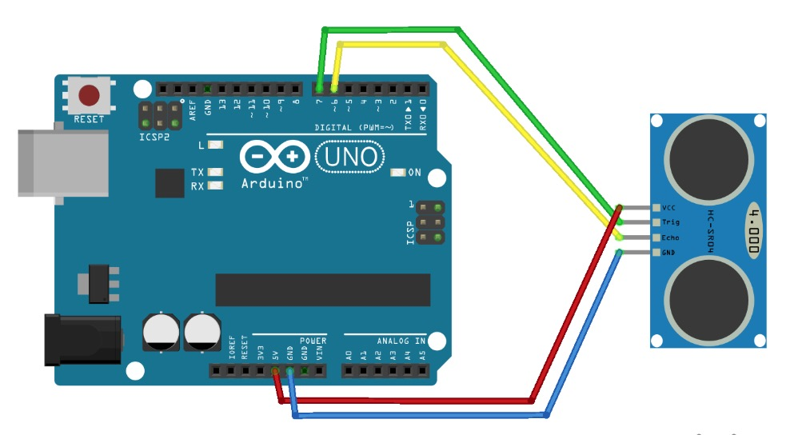
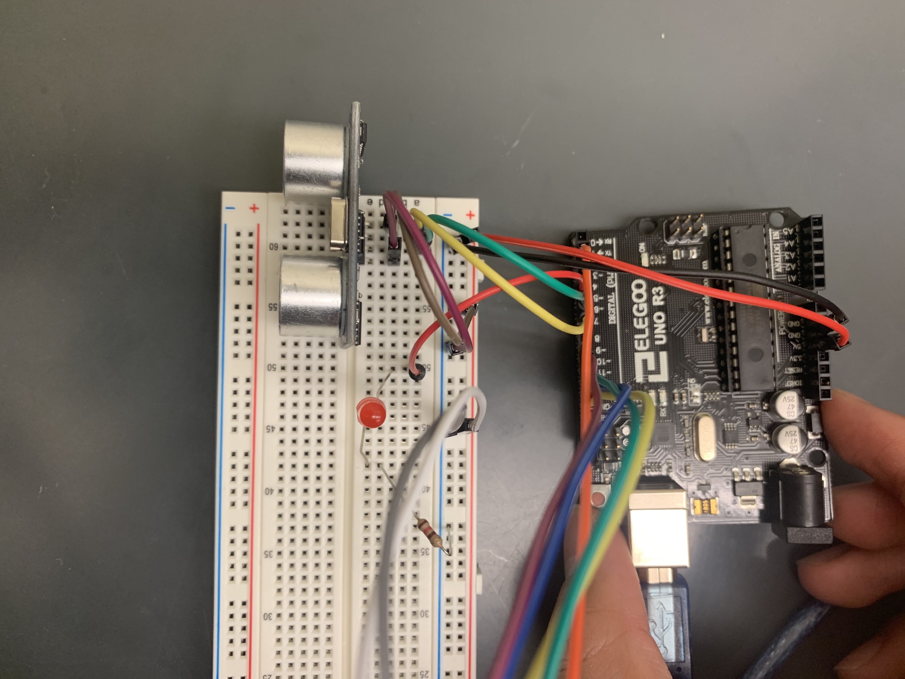

> We'll learn some basics of how to interact with Arduino and sensors. Since I had zero experience in Electrical Engineering (EE), I'll need to start from scratch, literally.

List of components:
* [Arduino UNO R3](https://www.amazon.com/gp/product/B01EWOE0UU/ref=ox_sc_act_title_8?smid=A2WWHQ25ENKVJ1&psc=1)
* [Distance Sensor (comes with a bunch of jump wires)](https://www.amazon.com/gp/product/B01COSN7O6/ref=ox_sc_act_title_6?smid=A2WWHQ25ENKVJ1&psc=1)
* [Air Quality Sensor](https://www.amazon.com/gp/product/B00LSG5IZ2/ref=ox_sc_act_title_3?smid=A30QSGOJR8LMXA&psc=1)
* [Solderless Breadboard](https://www.amazon.com/EL-CP-003-Breadboard-Solderless-Distribution-Connecting/dp/B01EV6LJ7G/ref=sr_1_2_sspa?ie=UTF8&qid=1541881834&sr=8-2-spons&keywords=breadboard&psc=1)
* [Jumper wires](https://www.amazon.com/gp/product/B073X7P6N2/ref=ox_sc_act_title_1?smid=A2X3UMRR9X7102&psc=1)
* [LED light](https://www.amazon.com/gp/product/B0739RYXVC/ref=ox_sc_act_title_1?smid=A2WWHQ25ENKVJ1&psc=1) and basics for [circuit calculation](https://www.evilmadscientist.com/2012/resistors-for-leds/)
* [120 Ohm Resistor](https://www.amazon.com/gp/product/B0185FF93E/ref=ox_sc_act_title_1?smid=AODFMOUHD0RRM&psc=1)

## Connect Arduino with Sensors
I knew nothing about wiring so I should first figure out the basics.

### Breadboard

Breadboard provides a working platform to arrange a lot of jump wires and correctly routing them to the target components.

One board has two separate panels, each of which includes +/- power rails and rows of 5-slot terminal strips. Under the hood, an entire red or blue power rail is a connected metal, and each 5-slot row is connected (not an entire row! The row is separated into two by the DIP support, Dual In-line Package). Usually, you connect positive pole (like "5V", "3.3V" on the power pins of Arduino) to the + rail and ground pole ("GND") to the - rail. See the [tutorial](https://learn.sparkfun.com/tutorials/how-to-use-a-breadboard/all) for details.

### Sensor
Take [ultrasonic distance sensor](https://www.amazon.com/gp/product/B01COSN7O6/ref=ox_sc_act_title_6?smid=A2WWHQ25ENKVJ1&psc=1) for example (other sensors may be very similar), it has four pins: VCC (Voltage Common Collector, 5V), Trig, Echo, GND (0 voltage). We need to connect "5V" to VCC, GND to GND, either via breadboard or directly from Arduino. Now the sensor is powered, where is its function?
The sensor is a generator and a receiver. Trig can be signaled by Arduino to release sonic burst, and Echo will receive the echo and tell Arduino. These types of interaction are all handled by the Digital I/O pins on Arduino. Numbers doesn't matter, just ensure you program in the same way as you design the circuit.
[Arduino + Ultrasonic sensor tutorial](https://howtomechatronics.com/tutorials/arduino/ultrasonic-sensor-hc-sr04/) is a good example.

### LED
Note that the long head is +, short head is -, and the LED should be in series with a resistor (we use 120 Ohm in this case under 5V power supply since its working current is about 20 mA).

### Arduino
All Arduino documentation can be found [here](https://www.arduino.cc/reference/en/#page-title). Besides, [Adafruit Arduino tutorial](https://learn.adafruit.com/ladyadas-learn-arduino-lesson-number-0/headers) is very helpful for introduction of Arduino components, and [[1]](https://randomnerdtutorials.com/complete-guide-for-ultrasonic-sensor-hc-sr04/) and [[2]](https://howtomechatronics.com/tutorials/arduino/ultrasonic-sensor-hc-sr04/) specifically teaches the connection and coding with HC-SR04 sensor.

#### Pins
There are two rows of pin heads on Arduino. One panel says "digital" pins, and the other "analog" pins. What're the differences?
* Digital pins are **binary** such that they tells you that the voltage is either over or under some preset thresholds. Very **fast**. Example: A light switch is on or off. That is a digital device, and gets connected to a digital pin. Usage: `digitalRead(), digitalWrite()`
* Analogue pins have a range of possible values so they can tell you fairly precisely what the (relative) voltage is on a pin. **Slow**. Example: A accelerator can have a range of read values. That is an analog device, and gets connected to an analog pin. Usage: `analogRead(), analogWrite()` returns any number from 0-1023.
* One special thing is that there are 3,5,6,9,10,11 pins prefixed with a `~`. They allows Pulse Width Modulation (PWM) adjustment. PWM is important in fine-tuning digital pins (binary) to achieve a similar effect of analog pins (ranged). See [PWM](diy-robots.com/?p=814) for details.

This is the example connection we built for a simple warning system:



Trig, Echo, and LED are connected to pin 7, 6, 5 respectively. The LED is in series with a 120 Ohm resistor.

Use the following code to trigger LED when distance is closer than 30cm:

```c
// Designate pin usage
int trigPin = 7;
int echoPin = 6;
int ledPin = 5;

// Define variables
long duration;
float distance;

void setup() {
    // put your setup code here, to run once

    Serial.begin(9600); // open serial port, sets data rate at 9600 bps (bits per second)
    pinMode(trigPin, OUTPUT); // trigPin to output pulse
    pinMode(echoPin, INPUT); // echoPin to receive response
    pinMode(ledPin, OUTPUT); // ledPin to trigger light
}

void loop() {
    // put your main code here, to run repeatedly

    // HC-SR04 sensor is triggered by a HIGH pulse of 10 or more microseconds.
    // Give a short LOW pulse beforehand to ensure a clean HIGH pulse
    digitalWrite(trigPin, LOW);
    delayMicroseconds(5);
    digitalWrite(trigPin, HIGH);
    delayMicroseconds(10);
    digitalWrite(trigPin, LOW);

    // Read the signal from the sensor: a HIGH pulse whose
    // duration is the time (in microseconds) from the sending
    // of the ping to the reception of its echo off of an object.
    duration = pulseIn(echoPin, HIGH);

    // Calculating the distance (sound speed 343m/s = 0.0343 cm/us)
    distance = duration * 0.0343 / 2; // in cm

    Serial.print("Distance: ");
    Serial.print(distance, 2); // 2 decimal point
    Serial.println("cm");
    if (distance < 30) {
      digitalWrite(ledPin, HIGH);
      delay(250); // keep LED light on for 250 ms
      digitalWrite(ledPin, LOW);
    }

    delay(100); // get a calm stdout screen
}
```

Steps:
  * Install Arduino IDE on laptop
  * Write code in the panel
  * "Verify" --> "Upload", first-time use it will ask you to choose a device, just select Arduino. Upload means you can burn your code onto Arduino
  * Go to "Tools" --> "Port" to designate the Arduino you're working on (in case of multiple existences)
  * "Serial Monitor" is like the stdout for you to debug

`digitalWrite()` is the way to send pulse from Arduino to sensors, while `pulseIn()` is the other way around. `INPUT, OUTPUT, HIGH, LOW` are macros. In `digitalWrite()`, `HIGH` is the pin you connect (like 5V or 3.3V), `LOW` is ground (0); In `pulseIn()`, `HIGH` is >3V, `LOW` is <1.5V. Note that Arduino is single-chip microcomputer (MCU), so after you upload the code, it will start looping upon powered on. Simple-minded.

You can load and save files in `.ino` format. When opened with text editor, it's just C code with no metadata.
