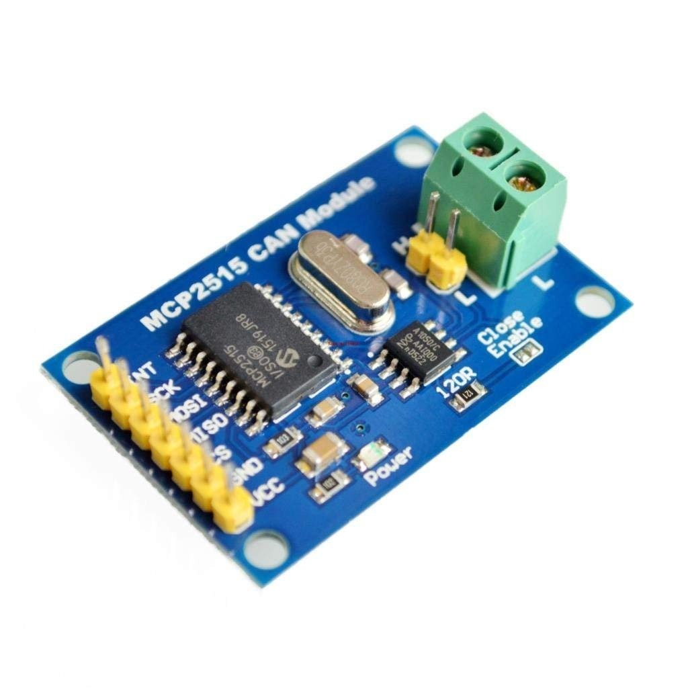
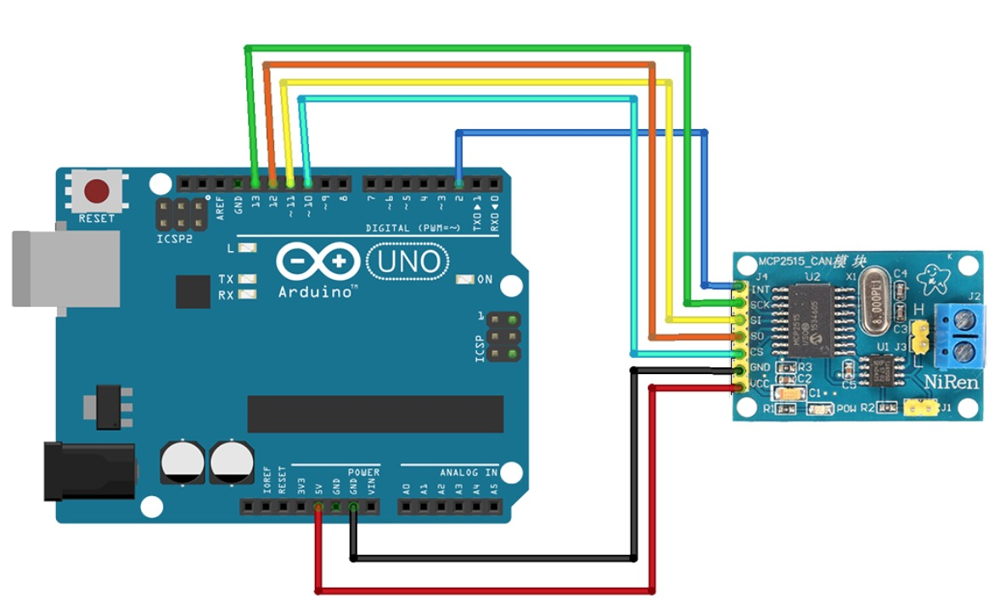
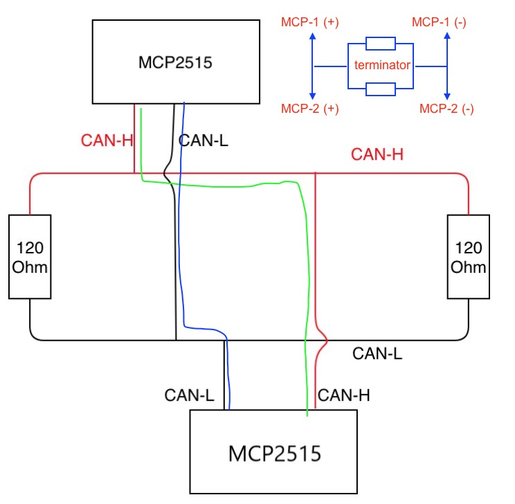
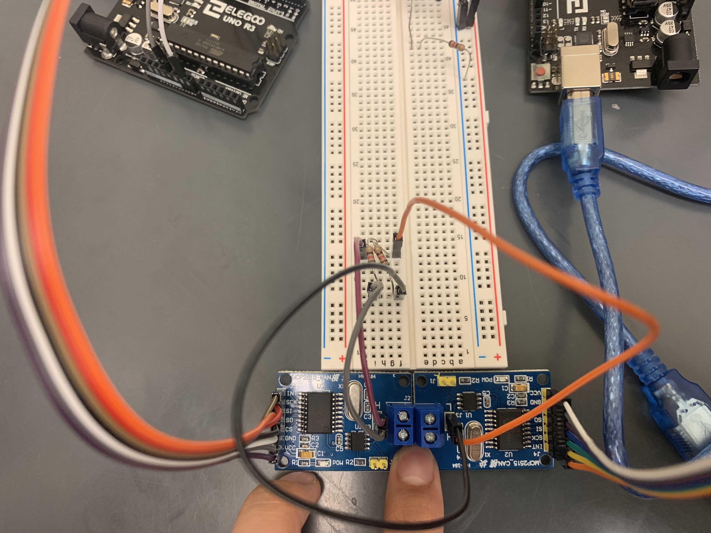
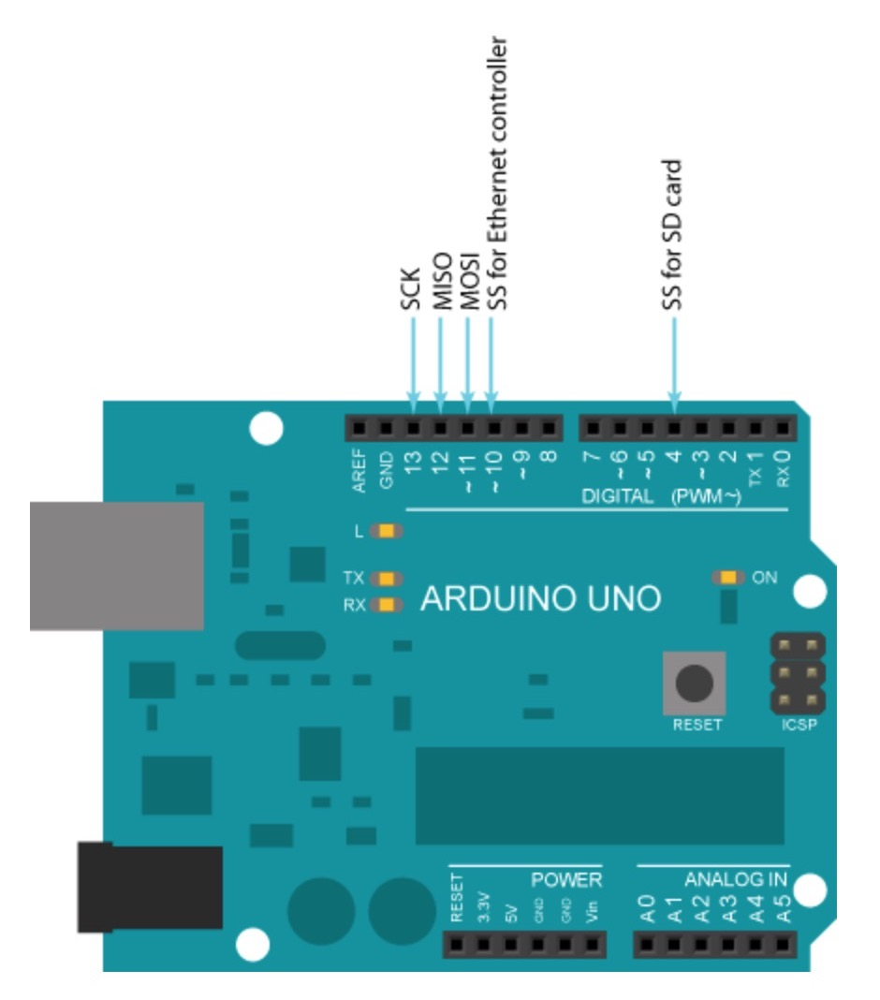
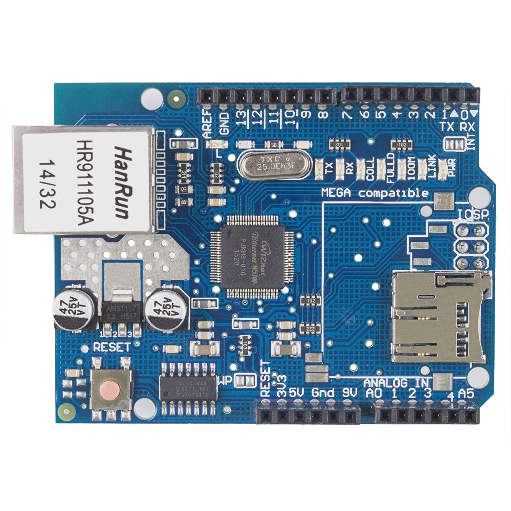

> We'll let two (or more) Arduinos to communicate with each other, i.e. send/receive messages. This is achieved by leveraging CAN bus.

Questions:
* Why use 120 Ohm in parallel in the CAN bus?
* Why we need another Arduino?

List of components:
* Arduino board
* [MCP CAN bus module](https://www.amazon.com/HiLetgo-MCP2515-TJA1050-Receiver-Arduino/dp/B01D0WSEWU/)
* [Arduino Ethernet shield-1](https://www.amazon.com/gp/product/B01E5JY7UU/ref=ox_sc_act_title_1?smid=APU90DTITU5DG&psc=1) or [2](https://www.amazon.com/gp/product/B00HG82V1A/ref=ox_sc_act_title_7?smid=ADHH624DX2Q66&psc=1)

## Build CAN Bus
Controller Area Network (CAN) bus is a two-wire, half-duplex communication **protocol** that is widely used in Automotive industry. One of its greatest advantages is that it connects any number of Engine Control Units (ECU) (or microcontrollers) in your car through the two-wire bus, CAN High and CAN Low, reducing the weight of wires that could be gained by using point-to-point communication between ECUs.

There is no direct connections available between two Arduinos. In this case, two CAN modules are required, one for each Arduino. A problem is that CAN protocol is vastly different from Ethernet (IP protocol) as there doesn’t exist unicast in CAN, and **every message is broadcast on the bus**. There do exist, though, a priority mechanism, so that higher priority messages would be read first if a collision happens in the CAN protocol. To resolve the protocol different between CAN network and IP network, we will implement a CAN-IP translation module (that exchange CAN messages and IP packets) later. But for now, let's figure out how to connect two Arduinos.




The MCP2515 CAN controller is powered by the 5V power supply from the Arduino, and translates the messages sent from the digital Pins of the Arduino into CAN messages on the bus through its two CAN-H and CAN-L pins. Connections: D13<->SCK, D12<->SO, D11<->SI, D10<->CS, D2<->INT, GND<->GND, 5V<->VCC. D10 is for chip-select, D2 is for input.

Please be aware that these pins are not random, as PIN 13, 12, 11 and 10 are the PINs used by the Serial Peripheral Interface (SPI) protocol to build a master/slave connection between the Arduino and the MCP2515 CAN controller. The SPI protocol allows multiple slave devices to co-exist on the same master, so that you can stack multiple devices together. (Arduino only have 10-13 pins, how to have multiple slave devices? See [Arduino Shield](https://www.freetronics.com.au/pages/stacking-arduino-shields#.XXLOmZNKhE4) and [StackOverflow](https://electronics.stackexchange.com/questions/13618/how-many-shields-can-i-plug-into-arduino). Note that "shield" means an extension board that adds function to the main Arduino board)




We've had some problem connecting the bus because the circuit doesn't look clear. The image and the re-plotted figure may be useful. Note that a "bus" means data are transferred from High (+) to High (+) and Low (-) to Low (-), where between High & Low is the terminator/resistor (so that data won't go from a High to Low). However, the reason of using two 120 Ohm in parallel is unclear because that's just an equivalent 60 Ohm resistor but the CAN bus needs 120 Ohm.

Now the hardware part is done.

## Transfer Data

> We'll then build duplex communication between sensor Arduino and Raspberry Pi (via Ethernet).

Steps:
* Translate the distance sensor data into CAN messages (on Arduino-1) and send to Arduino 2 via MCP-CAN bus (using [MCP-CAN library](https://github.com/coryjfowler/MCP_CAN_lib))
* Translate the CAN messages into IP packets (on Arduino-2) and send on the gateway (using [Ethernet Shield library](https://github.com/arduino-libraries/Ethernet)).
* Receive decision from RPi and send back to Arduino-1 end. Just the opposite direction of step 1 and 2.

### 1. CAN bus communication
Use [MCP-CAN library (herein)](https://github.com/coryjfowler/MCP_CAN_lib) or [CAN_Shield library](https://github.com/Seeed-Studio/CAN_BUS_Shield) following [Tutorial](https://www.instructables.com/id/Yes-We-CAN-BUS-With-Arduino-in-30-Seconds/).

In Arduino IDE, Sketch--Include Library--Add .zip library or directly unzip to `Users/HHH/Documents/Arduino/libraries/`. Then go to File--Examples, down below you will see examples come with the library.

For send example:
```c
#include <mcp_can.h>
#include <SPI.h>

MCP_CAN CAN0(10); // Set CS (chip select input pin for SPI) to pin 10, should be the same as wire connection

void setup()
{
    Serial.begin(115200);

    // Initialize MCP2515 running at 16MHz with a baudrate of 500kb/s and the masks and filters disabled.
    if(CAN0.begin(MCP_ANY, CAN_500KBPS, MCP_16MHZ) == CAN_OK) Serial.println("MCP2515 Initialized Successfully!");
    else Serial.println("Error Initializing MCP2515...");

    CAN0.setMode(MCP_NORMAL); // Change to normal mode to allow messages to be transmitted
}

byte data[8] = {0x00, 0x01, 0x02, 0x03, 0x04, 0x05, 0x06, 0x07};

void loop()
{
    // send data:  ID = 0x01, Standard CAN Frame, Data length = 8 bytes, 'data' = array of data bytes to send
    byte sndStat = CAN0.sendMsgBuf(0x01, 0, 8, data);
    if(sndStat == CAN_OK){
      Serial.println("Message Sent Successfully!");
    } else {
      Serial.println("Error Sending Message...");
    }
    delay(100); // send data per 100ms
}
```

For recv example:
```c
#include <mcp_can.h>
#include <SPI.h>

long unsigned int ID;
unsigned char len = 0;
unsigned char buf[8];
char msgString[128]; // Array to store serial string

int INTPin = 2; // Set INT to pin 2
MCP_CAN CAN0(10); // Set CS to pin 10

void setup()
{
  Serial.begin(115200);

  // Initialize MCP2515 running at 16MHz with a baudrate of 500kb/s and the masks and filters disabled.
  if (CAN0.begin(MCP_ANY, CAN_500KBPS, MCP_16MHZ) == CAN_OK)
    Serial.println("MCP2515 Initialized Successfully!");
  else
    Serial.println("Error Initializing MCP2515...");

  CAN0.setMode(MCP_NORMAL); // Set operation mode to normal so the MCP2515 sends acks to received data.

  pinMode(INTPin, INPUT);  // Configuring pin for /INT input

}

void loop()
{
  if (!digitalRead(INTPin)) // If CAN0_INT pin is low, read receive buffer
  {

    CAN0.readMsgBuf(&ID, &len, buf); // Read data: len = data length, buf = data byte(s)

    for (byte i = 0; i < len; i++){
      sprintf(msgString, " 0x%.2X", buf[i]);
      Serial.print(msgString);
    }

    Serial.println();
  }
  // receiver will keep pulling from the buffer
}
```

Note that the ID is not sender ID, it's an indicator for message priority (lower number, higher priority)! This is very practical in CAN car communication to indicate emergency situations. After the ID is the real data. In the above example, 8 bytes (64 bits) are sent and it can indeed contain a lot of information. Bit manipulation (shifting, masking) can be used to allow efficient data packing. See [bit packing (there are typos with bit manipulation in the blog though)](https://www.instructables.com/id/Yes-We-CAN-BUS-With-Arduino-in-30-Seconds/) for example in a real-life CAN. For bit-packing, `0b` for binary, `0o` for octal, `0x` for hex.

Also note that when we debug using the serial monitor, we should tune data rate to the one we set in the code (e.g. 115200), otherwise the data stream can't be propely decoded.

### 2. CAN-IP gateway
[Youtube tutorial](https://www.youtube.com/watch?v=8KhtkUTJfok).

Ethernet shield can bring the Arduino board online (either a server of a client, and concurrency is allowed) via the official [Ethernet Shield library](https://github.com/arduino-libraries/Ethernet), and has a SD-slot to read/write files via the official [SD library](https://www.arduino.cc/en/Reference/SD). It communicates with Arduino via SPI bus.

Arduino | Shield
--- | ---
 | 

To use it, simply stack it on top of Arduino and align every pin. Connect power to Arduino and network cable to shield. Note there are several LEDs on shield (from left to right):
* TX: blink when shield emits data
* RX: blink when shield receives data
* COLL: blink when collision
* FULLD: full duplex
* 100M: 100Mbps network
* LINK: network link, blink when data is transmitted or received
* PWR: power

Hardware part is done.

In Arduino IDE, Ethernet library is built-in. Just File-->Examples-->Ethernet. Select correct port and upload the code.
Several useful examples:
* To print the local IP of Ethernet shield (DHCP address dynamically allocated by the router, change every time when router is restarted), you can use the DhcpAddressPrinter in the examples, say you got `192.168.1.3`. You can then try `ping 192.168.1.3` to see if there is connection.
* To start a server, use WebServer example. MAC address may be printed on the shield, or you can just use default value in the example. IP address will be something like `192.168.1.173`. Just make sure the server address has the save prefixes as you router address and laptop address. It will listen to port 80.
