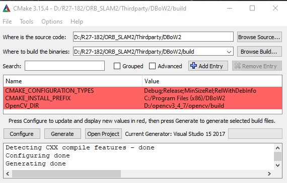

Don't download the official [ORB-SLAM2](https://github.com/raulmur/ORB_SLAM2), that's mainly for Linux and gcc compiler. For windows, check [ORBSLAM24Windows](https://github.com/phdsky/ORBSLAM24Windows). For example, in `DBoW2/Forb.cpp`, the original version used `#include <stdint-gcc.h>` which can't be compiled in VS.

[Tutorial](https://github.com/Phylliida/orbslam-windows)
[Tutorial](https://blog.csdn.net/yfic000)

### OpenCV
Download [OpenCV](https://opencv.org/) 3.4.7, extract to anywhere you like. Better create a folder with version no such as `opencv_3_4_7`.
Add
`YOUR_OWN_PATH\opencv\build;` for ffmpeg `YOUR_OWN_PATH\opencv\build\x64\vc15\bin;` for cv
to environment variable "Path"

###DBoW2, g2o, Pangolin

cmake-gui, Configure-Select 'VS 15 2017; x64'-Generate
Release mode for all builds here. Build with VS, a lot of errors, no worries.
Almost the same for **g2o** but add `WINDOWS` in g2o--Properties--C/C++--preprocessor definitions, and same for **Pangolin**. But Palingo will complain about `git` not installed in terminal, just download and install git. Will see error "can't open pthread.lib", ignore it.

###ORB-SLAM2
Same as before.

### Example
Dataset downloaded at: [link](https://vision.in.tum.de/data/datasets/rgbd-dataset/download)

specify input arguments for the program, and project--Set as Startup Project, then Debug-Start without Debugging.

[semidense](https://blog.csdn.net/heyijia0327/article/details/52464278)

[dense](https://github.com/raulmur/ORB_SLAM2/issues/220)
[retrieve](https://github.com/raulmur/ORB_SLAM2/issues/468)

[recon review](https://www.dronezon.com/learn-about-drones-quadcopters/drone-3d-mapping-photogrammetry-software-for-survey-gis-models/)
