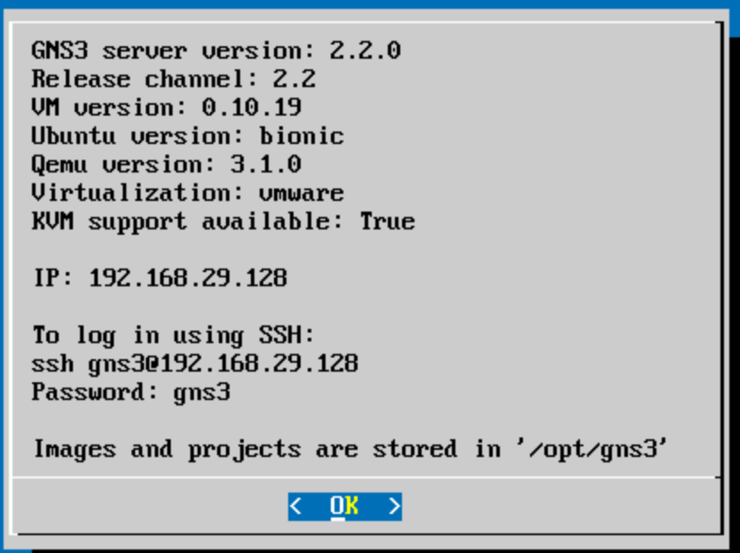

### Step 1 Setup VM
* Download VMware (Fusion for Mac, Workstation Player for Windows/Linux)
* Download [GNS3](https://www.gns3.com/software) and [GNS3 VM image](https://www.gns3.com/software/download-vm)
* In VMware, drag GNS3 VM.ova to install the VM using default settings
* In GNS3, it will identify GNS3 VM and automatically boot the VM in VMware
* To test successful installation, you should be able to ssh to the VM from your laptop's terminal


### Step 2
Please complete step 1 on your own laptop, and let's try to meet on Friday's office hour, are you guys available?

in GNS3, when adding VM, go to Edit-Network and "Allow GNS3 to overwrite"


```bash
sudo apt-get install mosquitto
sudo apt install git
sudo apt-get install python3-pip
git clone https://github.com/eclipse/paho.mqtt.python
cd paho.mqtt.python/
python3 setup.py install

# run example
cd examples/
python3 client_sub.py
```
